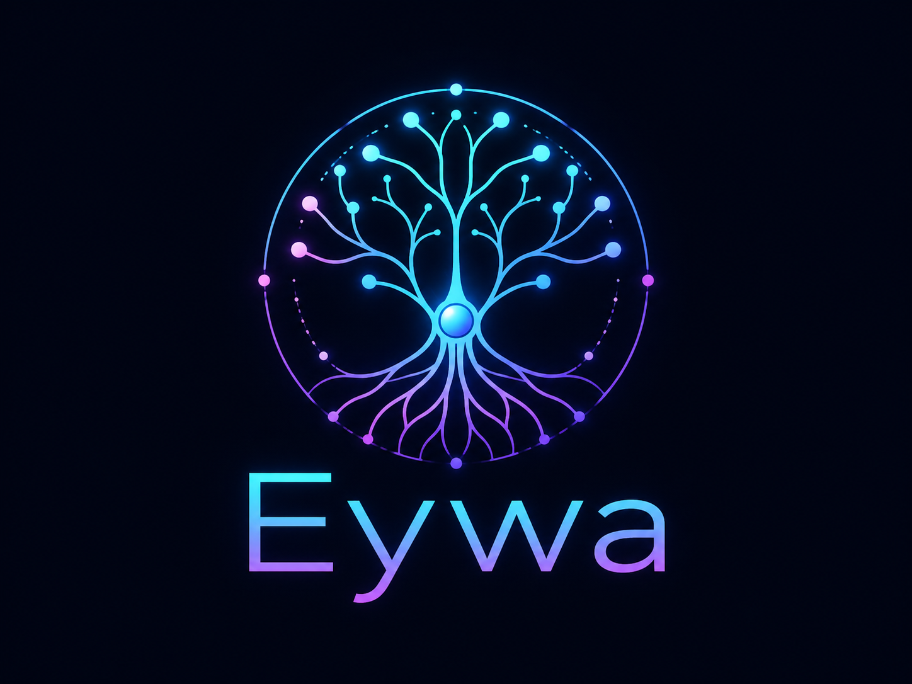
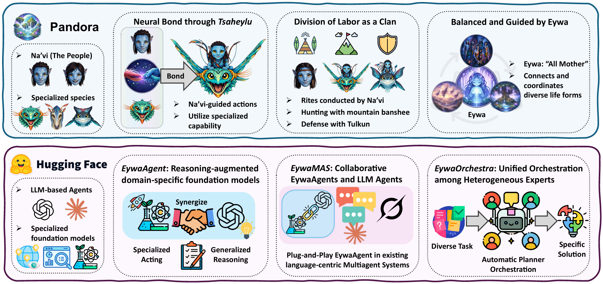
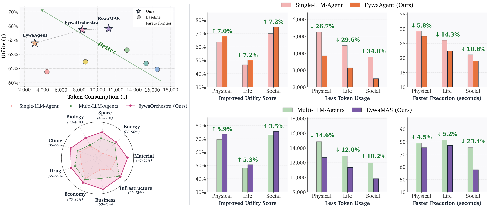

<div align="center">

<p align="center">
  
</p>

# Heterogeneous (Scientific) Foundation Model Collaboration


**Bring Domain-Specific Foundation Models into Agentic Systems.**

In *Avatar* franchise, *Eywa* ("All Mother") is a planetary-scale network. She connects and coordinates diverse life forms.<br/>
We bring *Eywa* from a fictional world into the digital world, for orchestrating heterogeneous foundation models.

[](https://www.python.org/)
[](LICENSE)

<!-- [](https://modelcontextprotocol.io/) -->

<p align="center">
  
</p>

</div>

---

## ✨ What's inside

- **Three execution modes.** Eywa has three instantiations: `single-agent`, `multi-agent`, and `orchestration`.
- **A cross-domain benchmark.** `eywabench.parquet` covers various scientific domains spanning material, energy, space, biology, clinic, drug, economy, business, and infrastructure.
- **Foundation model - Language Model "Tsaheylu".** Robust and stable communication channels between a domain-specific foundation model and a language model.
- **Async + worker pool.** `--num_workers` runs many tasks concurrently; each worker gets its own pair of MCP servers on isolated ports.

## ⚙️ Environment Setup

This repository requires several dependencies to be installed: [langchain](https://docs.langchain.com/oss/python/langchain/install), [langchain-mcp](https://docs.langchain.com/oss/python/langchain/mcp), [langchain-openai](https://docs.langchain.com/oss/python/langchain/install), [langchain_google_genai](https://pypi.org/project/langchain-google-genai/), [fastmcp](https://gofastmcp.com/getting-started/installation), [autogluon](https://auto.gluon.ai/dev/install.html), [tabpfn](https://github.com/PriorLabs/TabPFN)

> **Note:** The commands below are a recommended starting point, not a fully portable installer. Dependency resolution can vary across operating systems, CUDA builds, and upstream package updates. If installation fails, create a fresh environment and follow the upstream installation guides linked above, especially for AutoGluon and TabPFN.

```bash
conda create -n eywa python=3.10
conda activate eywa
pip install autogluon
pip install tabpfn
pip install langchain langchain-openai langchain-mcp-adapters langchain-google-genai fastmcp
```

## 🚀 Quickstart

```bash
# 1. Set up your environment yourself; then drop API keys into .env
cp .env.example .env
# edit OPENAI_API_KEY / GOOGLE_API_KEY

# 2. Launch foundation-model MCP servers (one pair per worker)
python launch_mcp_servers.py --num_workers 4

# 3. Run an experiment (in a second terminal)
python main.py --eywa --eywabench_name eywabench --exp_name first-run

# 4. Aggregate per-domain metrics
python eywabench/run_eval.py --exp_name first-run_gpt-5-nano_single-agent_eywa
```

> 💡 Outputs land in `experiments/<output_folder>/<exp_name>_<model>_<setting>[_<multi_agent_type>][_eywa]/`.
> Re-running with the same `--exp_name` resumes any unfinished tasks.

## 🧪 Three Stages of Eywa

### Single agent

```bash
# Plain LLM baseline
python main.py --eywabench_name eywabench --exp_name baseline --model gpt-5-nano

# LLM + foundation model (Eywa)
python main.py --eywabench_name eywabench --exp_name eywa-run --model gpt-5-nano --eywa

# Parallelize across 16 workers
python main.py --eywabench_name eywabench --exp_name eywa-run --eywa --num_workers 16
```

### Multi agent

`--agents` takes specs of the form `<type>:<llm>` where `<type>` is `base` (plain LLM) or `eywa` (LLM + FM via MCP).

```bash
# Switching EywaAgent with LLM Agent in MAS -> EywaMAS
python main.py --eywa --setting multi-agent --multi_agent_type debate \
  --agents eywa:gpt-5-nano base:gpt-5-nano \
  --exp_name eywa-debate
```

### Orchestration

```bash
python main.py --eywa --setting orchestration --exp_name orch
```

The planner emits a JSON plan per task that picks the setting, the LLM(s), whether to use Eywa, and which foundation model. Plans are cached in `orchestration.jsonl` and reused on resumed runs.

## 🧱 Repository layout

```
HMAS-exp-dev/
├── main.py                    # Async runner: dispatches tasks → records results
├── launch_mcp_servers.py      # Spawns one chronos + tabpfn server per worker
│
├── eywa/
│   ├── agents/
│   │   ├── base_agent.py      # SingleAgent + traced invocation helper
│   │   ├── eywa.py            # EywaAgent (FM-LLM "Tsaheylu" via MCP)
│   │   └── multi_agent.py     # Multi-Agent System Topologies
│   ├── foundation_models/
│   │   ├── time_series/chronos.py   # Chronos2 wrapped as an MCP server
│   │   └── tabular/tabpfn.py        # TabPFN wrapped as an MCP server
│   ├── utils/                 # path / model_provider / parse / choose_prompt / langchain_mcp
│   └── configs/               # JSON CLI overrides
│
├── eywabench/
│   ├── eywabench.parquet      # The benchmark
│   ├── eval/                  # timeseries / tabular / nlp scorers
│   └── run_eval.py            # Per-domain + overall metrics
│
├── prompts/                   # User and orchestration prompt templates
├── .env.example               # Required API keys
└── LICENSE
```


## 🧮 Scoring

- **Time-series forecasting** — utility = `1 − (sMAPE/2 + MAAPE·2/π) / 2` ∈ [0, 1]
- **Tabular classification** — accuracy ∈ [0, 1]
- **Tabular regression** — same composite as time-series
- **Deep-principle physics / MMLU** — soft match: exact normalized → numeric relative error → token-F1 + character-similarity fallback (capped at 0.8)

## 🔌 Supported Models

| Provider | Models                                                               |
|----------|----------------------------------------------------------------------|
| OpenAI   | `gpt-5-nano`, `gpt-4.1-nano`, `gpt-5-mini`                           |
| Google   | `gemini-2.5-flash`, `gemini-2.5-flash-lite`, `gemini-3-flash-preview`|

Adding another provider is a one-liner in `eywa/utils/model_provider.py` plus a branch in `eywa/agents/base_agent.initialize_model`.

## 📊 Key Results

<p align="center">
  
</p>

## 📚 Citation

If Eywa is useful in your research, please cite:

```bibtex
@misc{eywa2026,
  title  = {Heterogeneous Scientific Foundation Model Collaboration},
  author = {Zihao Li, Jiaru Zou, Feihao Fang, Xuying Ning, Mengting Ai, Tianxin Wei,
Sirui Chen, Xiyuan Yang, Jingrui He},
  year   = {2026},
  note   = {\url{https://github.com/Violet24K/Eywa}}
}
```

## 📜 License

Released under the [Apache License 2.0](LICENSE).
